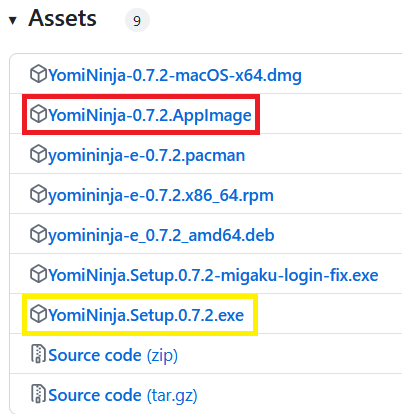

# OCR

I have only limited experience with Yomininja so far, so this section may get expanded on later.
Some other alternative OCR options are the OCR engine that comes with Agent, or [owocr](https://github.com/AuroraWright/owocr). (I have not tried them.)

## Get Yomininja

[Yomininja](https://github.com/matt-m-o/YomiNinja) has a lot of release files to cater for different operating systems; you don't need them all. Just download the `.AppImage` (example highlighted in the red box).

Get the `.exe` if you're going to run in Windows (example highlighted in the yellow box).

## Using the OCR

!!! note ""
    This section will be expanded later as I get around to trying it out more.

Launch your game, then just double click on the Yomininja AppImage to start it (it doesn't need any installation).
After that, configure Yomininja settings. Try out the different settings like always-on-top, or the different OCR engines.

Map a key to trigger Yomininja OCR in the game controller config.

Known limitations: the always-on overlay only works with windowed games in SteamOS (not full-screen or borderless window). You can either:

- alt-tab to the overlay like how you would alt-tab to a browser texthook page
- live with windowed mode for your game
- workaround by faking a full-screen experience by setting the taskbar to autohide, hiding the window titlebar, and maximizing the window through the taskbar

!!! warning
    Do not launch Yomininja with always-on-top and a full-screen game! I experienced the overlay blocking everything and couldn't quit Yomininja or the game, ended up having to force shut down by pressing the power button.
    Update: found out you can toggle or turn off the overlay. Make sure the shortcut is mapped to something before you start so you can avoid this experience of getting stuck!
