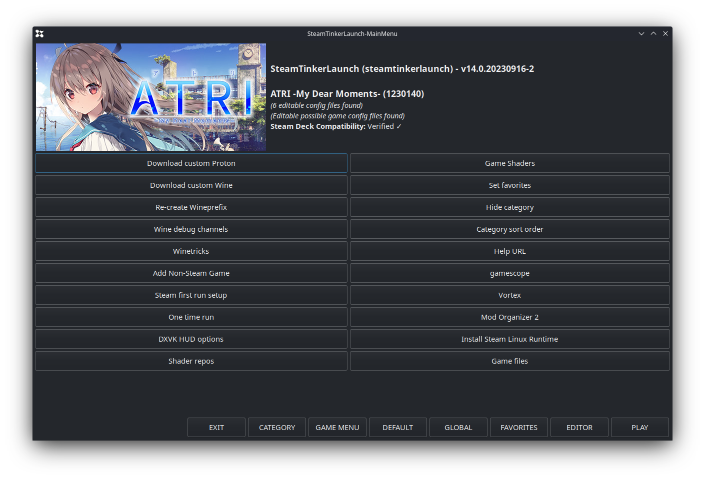
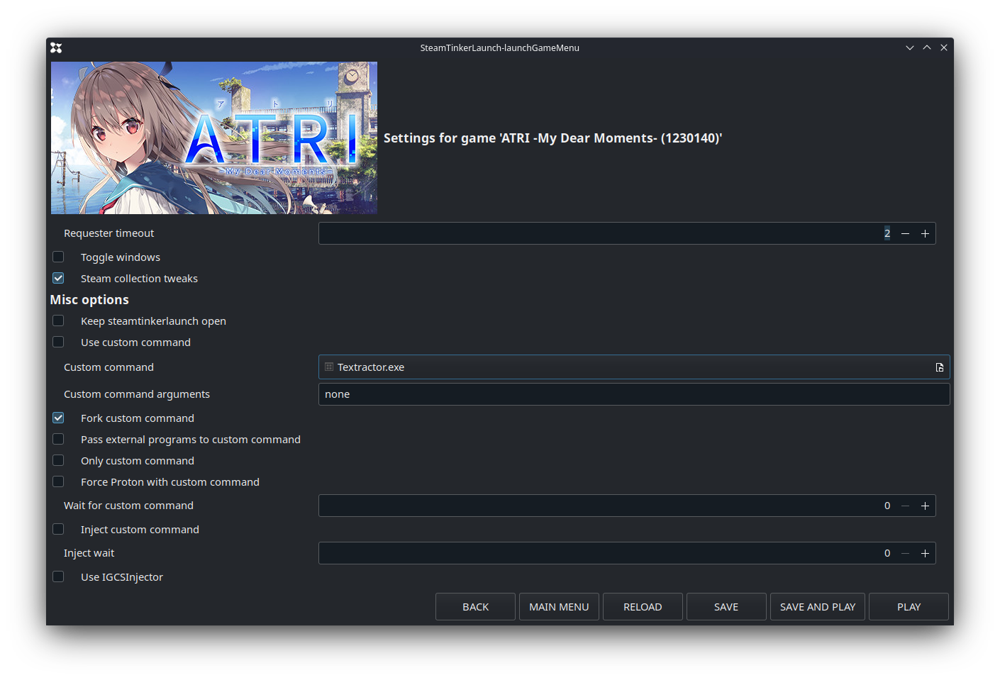

# Hooking Steam Games

How to hook Steam games (or games you've added shortcut to Steam and launching with Steam). We'll be using SteamTinkerLaunch to fork Textractor/Agent when the game starts. This ensures Textractor/Agent will start in the same proton/wine prefix as your game. (Don't sweat it if you don't understand that last sentence, you'll learn about it when you need to.)

1. download [SteamTinkerLaunch](https://github.com/sonic2kk/steamtinkerlaunch)
2. follow the [instructions at SteamTinkerLaunch page](https://github.com/sonic2kk/steamtinkerlaunch) to use it with your game, either as a Compatibility Tool (if the game is not native Linux and is running on Proton), or as a Launch Option (if the game is native Linux).
3. [this page](https://github.com/sonic2kk/steamtinkerlaunch/wiki/Steam-Compatibility-Tool) has a demo of adding as a compatibility tool
4. launch your game. By default the SteamTinkerLaunch menu will display for 2 seconds. Click on `MAIN MENU` before it disappears.
   (tip: the controller mapping for your game will be used, so you might find pressing the right trigger doesn't do a mouse click. You can use the touch screen instead, or else map something to left click in your game controller mappings.) The time this menu displays can be customized in SteamTinkerLaunch settings.
5. Click on `GAME MENU`.

6. In the game menu, tick `Fork custom command`, and click on the box beside `Custom command`. Select the program you need (Textractor or Agent) from where you saved them.

7. click on `SAVE AND PLAY`. Your game will launch together with the the program you put in #5.
8. hook the game with Textractor or Agent. (you may want to customize your game mappings so you can use trackpad as mouse and click. Especially for Agent where you'll need to drag & drop the crosshair.)
9. play the game, and Alt-Tab to the texthook page when you want to look up words, then Alt-Tab back. Enjoy!
10. optional: once you're sure you won't want to change anything in SteamTinkerLaunch for that game, you can disable the display before the game launches.

Note: SteamTinkerLaunch will always try to update itself before launching, so it'll take a bit more time to launch your games.
