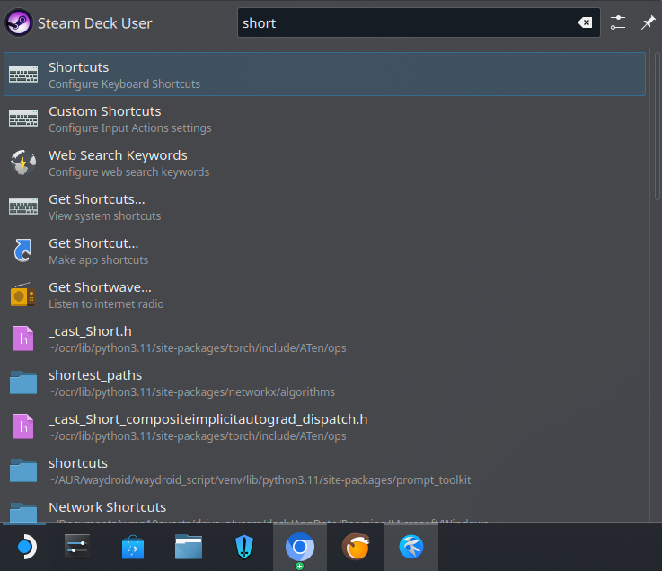
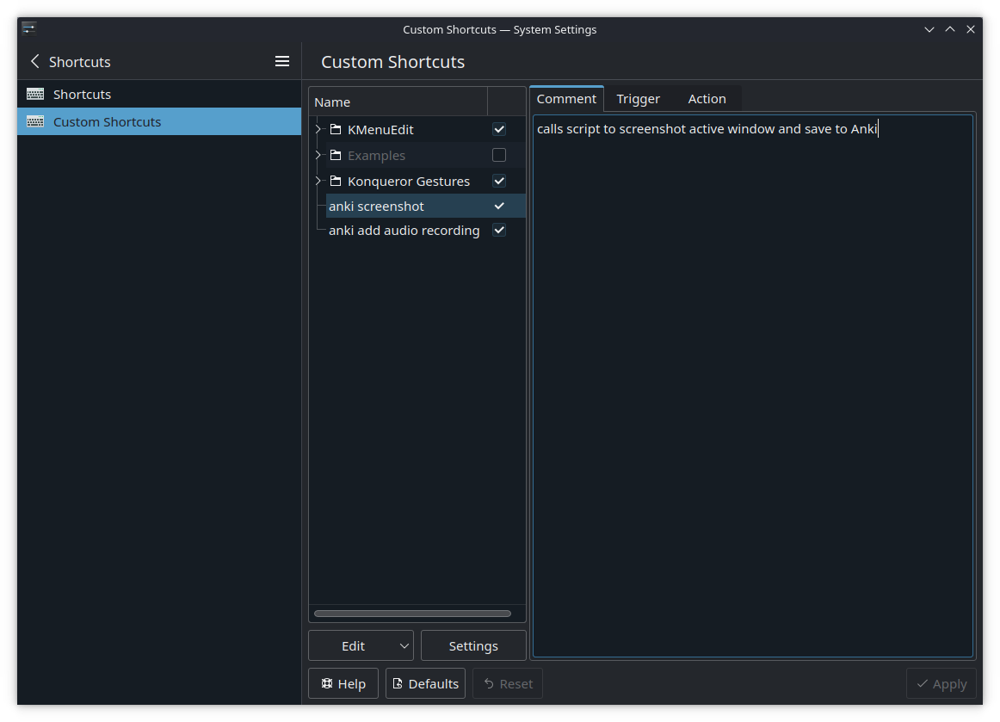
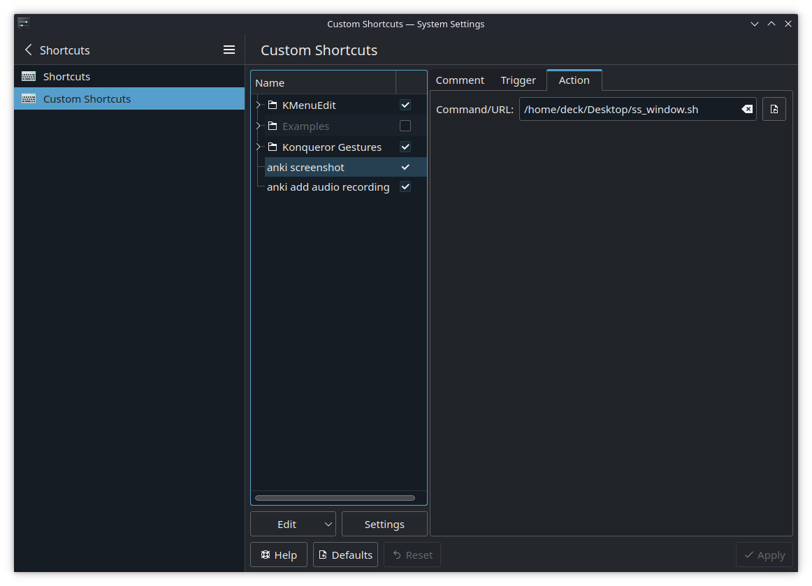

# Mining

## How to save screenshots to Anki

Save this shell script to your Deck, keep it somewhere you'll remember.

Calling this script will capture the active window and save it to the latest Anki note, and display a notification (depending on your notification settings, you may not see it when in-game).

With thanks to Xythh whom I got the code snippet from and just made minor edits to work on the Deck.

Change the `pictureField` variable if your field name in the Anki card is different.

``` bash title="ss_window.sh" linenums="1"
#!/bin/sh

### capture screnshot with spectacle
time=$(date +%Y-%m-%d-%H-%M-%S)
# do not change the tmp_file path unless you know what you're doing. Anki needs access to the filepath, and if you've installed the flatpak version using the discover store, you'll need to use something like flatseal to provide access to the path if it is different from below.
# flatpak version has access to the folder by default
tmp_file="/home/deck/.var/app/net.ankiweb.Anki/$time"
spectacle --background --activewindow --nonotify --output $tmp_file.jpg

### import to anki. Code taken from https://gist.github.com/xythh/96796571baa850783a0b49f4d325e5b2 with minor edits
ankiConnectPort="8765"
pictureField="Picture"

# This gets your notes marked as new and returns the newest one.
newestNoteId=$(curl -s localhost:$ankiConnectPort -X POST -d '{"action": "findNotes", "version": 6, "params": { "query": "is:new"}}' | jq '.result[-1]')

# if anki connect is running it will return your latest note id, and the following code will run, if anki connect is not running a notification pops up.
if [ "$newestNoteId" != "" ]; then
    curl -s localhost:$ankiConnectPort -X POST -d '{
        "action": "updateNoteFields",
        "version": 6,
        "params": {
            "note": {
                "id": '"$newestNoteId"',
                "fields": {
                    "'$pictureField'": ""
                },
                "picture": [{
                    "path": "'"$tmp_file"'.jpg",
                    "filename": "paste-'"$time"'.jpg",
                    "fields": [
                        "'$pictureField'"
                    ]
                }]
            }
        }
    }'
    notify-send "Saving screenshot to Anki..."
else
    notify-send "Ankiconnect is not running, unable to save screenshot to Anki card."
fi
rm "$tmp_file.jpg"
```

## How to record audio to Anki

Save this shell script to your Deck, keep it somewhere you'll remember.

Calling this script will start recording audio, calling it again will stop recording and save the audio clip to the latest Anki note.

Likewise, with thanks to Xythh for 99% of the code.

Change the `SentenceAudio` variable if your field name in the Anki card is different.

``` bash title="record_audio.sh"
#!/bin/sh

# Version 1.2
# script taken from https://gist.github.com/xythh/aab65a301a001ef6107cd54a360d4453 with minor edits
# shoutout to https://gist.github.com/Cephian/f849e326e3522be9a4386b60b85f2f23 for the original script,
# https://github.com/xythh/ added the ankiConnect functionality
# # toggle record computer audio (run once to start, run again to stop)
# # dependencies: ffmpeg, pulseaudio, curl
# # for Steam deck: use python (or perl) instead of bc (since bc is not installed by default)
#
# # where recording gets saved, gets deleted after being imported to anki
# do not change DIRECTORY unless you know what you're doing. Anki needs access to the filepath, and if you've installed the flatpak version using the discover store, you'll need to use something like flatseal to provide access to the path if it is different from below.
# flatpak version has access to the folder by default
DIRECTORY="/home/deck/.var/app/net.ankiweb.Anki/"
FORMAT="mp3" # ogg or mp3
# cut file since it glitches a bit at the end sometimes - I didn't need it, but you can enable if you see it.
#CUT_DURATION="0.1"
CUT_DURATION="0"
#port used by ankiconnect
ankiConnectPort="8765"
# gets the newest created card, so make sure to create the card first with yomichan
newestNoteId=$(curl -s localhost:$ankiConnectPort -X POST -d '{"action": "findNotes", "version": 6, "params": { "query": "is:new"}}' | jq '.result[-1]')
#Audio field name
audioFieldName="SentenceAudio"

#if there is no newest note, you either have a complete empty anki or ankiconnect isn't running
if [ "$newestNoteId" =  "" ]; then
 notify-send "anki connect not found"
 exit 1
fi

if pgrep -f "parec"; then
 pkill -f "parec"
else
 time=$(date +%s)
 name="$DIRECTORY/$time"
 wav_file="$name.wav"
 out_file="$name.$FORMAT"

 if ! [ -d "$DIRECTORY" ]; then
  mkdir "$DIRECTORY"
 fi
 notify-send -t 1000 "Audio recording started"
 #timeout 1m arecord -t wav -f cd "$wav_file"

 # just grabs last running source... may not always work if your pulseaudio setup is complicated
 if ! timeout 1m parec -d"$(pactl list sinks | grep -B1 'State: RUNNING' | sed -nE 's/Sink #(.*)/\1/p' | tail -n 1)" --file-format=wav "$wav_file";
 then

  notify-send "Error recording " "most likely no audio playing"
  rm "$wav_file"
  exit 1
 fi

 input_duration=$(ffprobe -v error -select_streams a:0 -show_entries stream=duration -of default=noprint_wrappers=1:nokey=1 "$wav_file")
#  output_duration=$(echo "$input_duration"-"$CUT_DURATION" | bc)
 output_duration=`python -c "print($input_duration-$CUT_DURATION)"`

 # encode file and delete OG
 if [ $FORMAT = "ogg" ]; then
  ffmpeg -i "$wav_file" -vn -codec:a libvorbis -b:a 64k -t "$output_duration" "$out_file"
 elif [ $FORMAT = "mp3" ]; then
  ffmpeg -i "$wav_file" -vn -codec:a libmp3lame -qscale:a 1 -t "$output_duration" "$out_file"
 else
  notify-send "Record Error" "Unknown format $FORMAT"
 fi
 rm "$wav_file"

# Update newest note with recorded audio
curl -s localhost:$ankiConnectPort -X POST -d '{
    "action": "updateNoteFields",
    "version": 6,
    "params": {
        "note": {
            "id": '"$newestNoteId"',
     "fields": {
                "'$audioFieldName'": ""
            },
            "audio": [{
                "path": "'"$out_file"'",
                "filename": "'"$time"'.'$FORMAT'",
                "fields": [
                    "'$audioFieldName'"
                ]
            }]
        }
    }
}'
# opens changed note, comment if you don't want it.
# curl -s localhost:$ankiConnectPort -X POST -d '{
#     "action": "guiBrowse",
#     "version": 6,
#     "params": {
#         "query": "nid:'"$newestNoteId"'"
#     }
# }'
 notify-send -t 1000 "Audio recording copied"
 rm "$out_file"
fi
```

## Adding keyboard shortcuts to call the screenshot and record audio scripts

You may want to connect a physical keyboard for this for an easier time. Alternatively, you can temporarily map the combos to a key in desktop config so you can register it, then remove the mapping later.

1. Open the keyboard shortcut settings from the start menu. (easiest way is to type to find it)
   
2. Click on `Custom Shortcuts` on the left.
3. Click `Edit`-> `New`-> `Global Shortcut` -> `Command/URL`
4. Rename it, eg. to "Anki screenshot"
5. Edit the trigger to a shortcut key combo (you'll need to map this to a controller button later). I use Alt+Shift+C for screenshot and Alt+Shift+A for audio recording, but this is totally up to you, just pick something unlikely to clash with anything else in-game or with other software.

6. Edit the action to the screenshot script you saved earlier. Put the path of the script in. (Reminder: if you move the file, you'll have to edit this shortcut.)

7. Repeat steps #3-6 for the script to record audio.

## Mapping the shortcuts and other actions to controller buttons

You'll want to map controller buttons to actions we need when mining.

Game controller config - you'll need to do this for every game. Map the shortcut triggers you set up earlier:

- save screenshot to card
- start/stop recording audio and save to card

```note
    todo: clarify with screenshots
```

Refer to [controller mapping](controller.md) for more details on other things to map.

## Enabling pop-up notification when saving screenshot or audio to Anki

```note
    todo: write section with screenshots. Need to change some system notification settings so it'll show up even when you have fullscreen windows.
```
